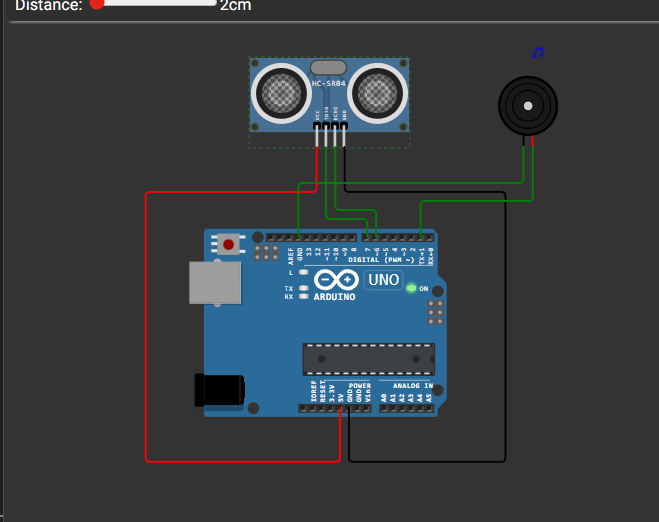

# Sistema de Alerta com Sensor Ultrassônico e Buzzer

Este projeto utiliza um sensor ultrassônico para medir distância e acionar um buzzer conforme a proximidade de um objeto.  
Além disso, quando a distância fica muito curta, o sistema simula uma requisição HTTP POST, como se estivesse enviando um alerta para um servidor.

---

## Componentes Utilizados

- Arduino Uno
- Sensor Ultrassônico (HC-SR04)
- Buzzer ativo ou passivo
- Jumpers para ligação dos pinos

---

## Conexões

### Sensor Ultrassônico

| Pino do Sensor | Pino no Arduino |
|---|---|
| TRIG | 7 |
| ECHO | 6 |

### Buzzer

| Componente | Pino no Arduino |
|---|---|
| Sinal do Buzzer | 1 |

---

## Funcionamento do Sistema

### 1. Leitura do Sensor

O Arduino envia pulsos pelo pino TRIG e mede o tempo que o sinal leva para retornar pelo ECHO.  
Esse valor é convertido em distância (cm).

### 2. Lógica de Alerta

#### 🔴 Menos de 15 cm  

- Alerta URGENTE  
- Buzzer toca rapidamente  
- Se menor que 10 cm, simula envio de requisição HTTP POST

#### 🟡 Entre 15 cm e 40 cm  

- Alerta moderado  
- Buzzer toca com intervalos mais longos

#### 🟢 Acima de 40 cm  

- Ambiente seguro  
- Buzzer desligado

---

## Simulação de HTTP POST

Quando a distância é **menor que 10 cm**, é impresso no Serial Monitor uma requisição simulada:

Isso simula uma comunicação de alerta mesmo sem internet ou Wi-Fi.

---

## Monitor Serial

O monitor exibe:

- A distância calculada  
- O estado atual do sistema (urgente, moderado ou seguro)  
- A requisição HTTP simulada quando aplicável

---

##  Como usar

1. Monte o circuito conforme as conexões acima  
2. Carregue o código no Arduino  
3. Abra o **Serial Monitor** a 115200 baud  
4. Aproxime objetos do sensor e observe o comportamento do buzzer e das mensagens

---

## Links

- [link wokiwi](https://wokwi.com/projects/447975703744875521)
- [Link repositório](https://github.com/Arthenry90/gs-edge-computing)

---

## Integrantes

- Artur Henrique Siqueira - RM566986
- Davi de Souza Malta - RM560327

## Imagem do circuito

